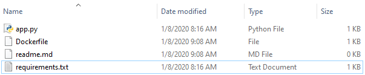
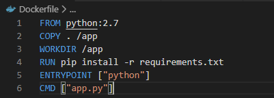
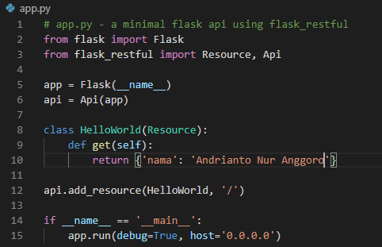
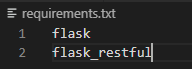
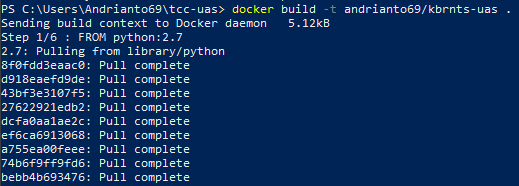
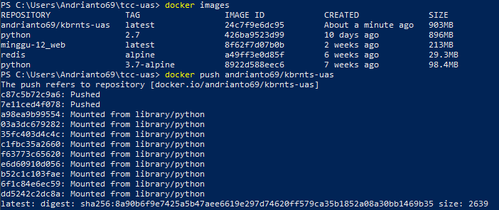
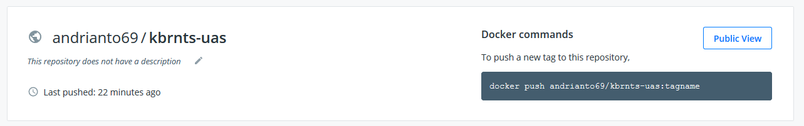
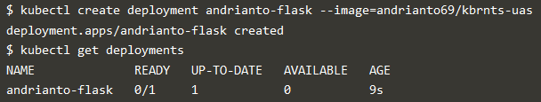
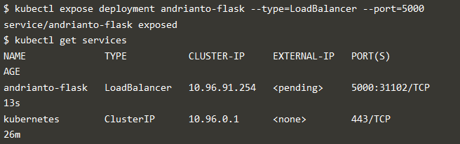
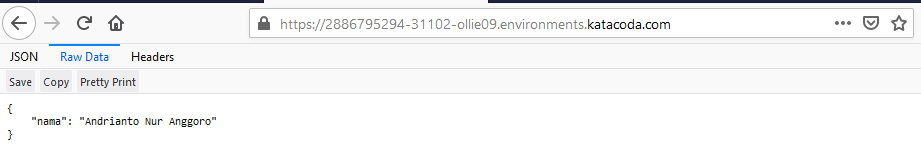

## PRAKTIK KUBERNETES
### Membuat docker image

1. Siapkan file untuk membuat docker image

2. Membuat docker image ke dalam dockerhub

3. Lakukan push ke dockerhub

4. Membuat deployment menggunakan docker dan kubernetes

5. Menjalankan menggunakan port 31102
